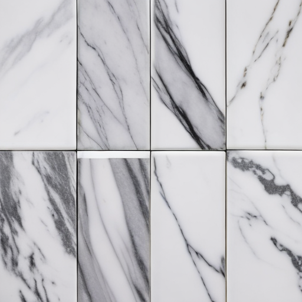
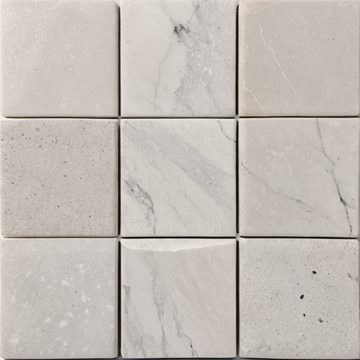
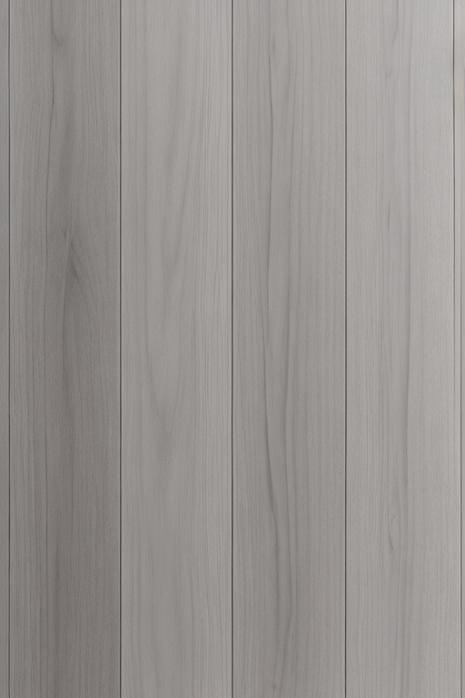
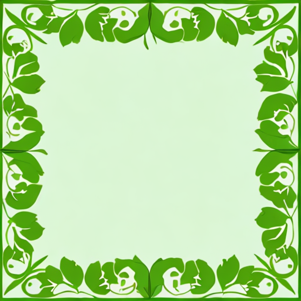
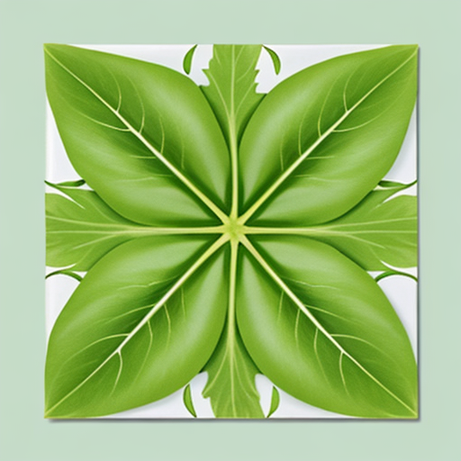
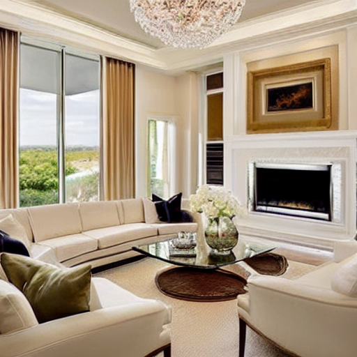
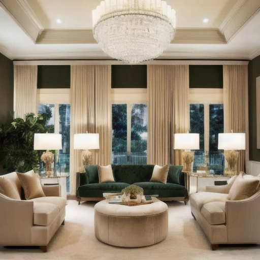
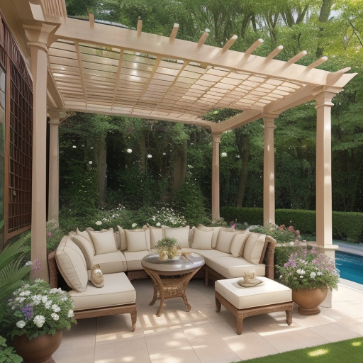

## 1. Gạch bông

### Positive prompt

**Subject**: a square ceramic tile with a *vintage/retro/modern/...* pattern.
**Design**: The tile has an eight-pointed star in white, with beige shapes in the corners on a terracotta background.
**Color Palette**: warm terracotta, creamy white, and light beige.
**Style**: flat, minimalist design with clean lines.
**Lighting**: displayed on a white background, no shadows, no reflections.

### Negative prompt

**Subject**: people, plants, car,...
**Design**: complex patterns, intricate designs, *floral patterns (optional)*, *random shapes (optional)*
**Color Palette**: neon, *(optional: the color that opposite to the color in positive prompt)*
**Style**: 3D effects, highly detailed, textured, rustic, grungy
**Lighting**: shadows, reflections, glare, dramatic lighting

### Example

#### Parameters

Checkpoint: [majicmixRealistic_v7.safetensors](https://huggingface.co/GreenGrape/231209/blob/main/majicmixRealistic_v7.safetensors)
Sampling method: DDIM
Sampling steps: 50
Batch count: 1
Batch size: 4
CFG Scale: 7
Seed: -1

## 2. Gạch vân đá

### Positive prompt

**Subject**: a marble like texture
**Design**: the tile has an warm gray veining, mimicking the natural patterns of marble.
**Color Palette**: primarily black gray with warm white veins.
**Style**: flat
**Lighting**: displayed on a white background, no shadows, no reflections.

### Negative prompt

**Subject**: people, plants, car, a tile
**Design**: complex patterns, intricate designs, heavy veining, bright colors, bold contrasts
**Color Palette**: neon
**Style**: 3D effects, highly detailed, textured, rustic, grungy
**Lighting**: shadows, reflections, glare, dramatic lighting
### Example

#### Parameters

Checkpoint: [majicmixRealistic_v7.safetensors](https://huggingface.co/GreenGrape/231209/blob/main/majicmixRealistic_v7.safetensors)
Sampling method: DDIM
Sampling steps: 50
Batch count: 1
Batch size: 4
CFG Scale: 7
Seed: -1

## 3. Gạch vân đá II

### Positive prompt

Subject: a natural stone pattern.
Design: The tile showcases irregularly shaped stone pieces in various shades of gray, arranged to mimic a natural stone mosaic with subtle texture and depth.
Color Palette: cool tones of gray, white, and light beige.
Style: flat design with a realistic stone texture, giving a natural and organic feel.
Lighting: displayed on a white background, no shadows, no reflections.

### Negative prompt

Subject: people, plants, vehicles, animals.
Design: floral motifs.
Color Palette: neon colors, bright and contrasting hues, warm colors.
Style: 3D effects, rustic, grungy.
Lighting: shadows, reflections, glare, dramatic lighting.
### Example

#### Parameters

Checkpoint: [majicmixRealistic_v7.safetensors](https://huggingface.co/GreenGrape/231209/blob/main/majicmixRealistic_v7.safetensors)
Sampling method: DDIM
Sampling steps: 50
Batch count: 1 (có thể tăng thêm)
Batch size: 1
CFG Scale: 7
Seed: -1
## 4. Gạch vân giả gỗ

### Positive prompt

**Subject**: a modern wood grain pattern.
**Design**: The tile features a dark wood grain texture, with subtle variations in the grain pattern, mimicking gray oak wood.
**Color Palette**: light gray with soft, cold undertones.
**Style**: flat, minimalist design with a realistic wood texture.
**Lighting**: displayed on a white background, no shadows, no reflections.

### Negative prompt

**Subject**: people, plants, vehicles, animals.
**Design**: complex patterns, intricate designs, floral patterns, geometric shapes.
**Color Palette**: neon colors, bright and contrasting hues.
**Style**: 3D effects, highly detailed, textured, rustic, grungy.
**Lighting**: shadows, reflections, glare, dramatic lighting.

#### Parameters

Checkpoint: [majicmixRealistic_v7.safetensors](https://huggingface.co/GreenGrape/231209/blob/main/majicmixRealistic_v7.safetensors)
Sampling method: DDIM
Sampling steps: 50
Batch count: 1
Batch size: 1
CFG Scale: 7
Seed: -1
Width: 512
Height: 768

## 5. Gạch sân vườn I

### Positive prompt

**Subject**: a square ceramic tile with a garden foliage pattern.
**Design**: The tile features dense green foliage with intricate leaf shapes, varying in shades of green and light yellow, giving the appearance of a lush, natural garden.
**Color Palette**: rich greens, light yellow accents, and soft shadows for depth.
**Style**: flat design with a realistic, organic texture, emphasizing natural and fresh aesthetics.
**Lighting**: displayed on a white background, no shadows, no reflections.

### Negative prompt

Subject: people, vehicles, stones, man-made objects.
Design: geometric patterns, abstract designs, stone textures.
Color Palette: neon colors, warm tones, grays, and muted colors.
Style: 3D effects, highly detailed, textured, rustic, grungy.
Lighting: shadows, reflections, glare, dramatic lighting.

#### Parameters

Checkpoint: [majicmixRealistic_v7.safetensors](https://huggingface.co/GreenGrape/231209/blob/main/majicmixRealistic_v7.safetensors)
Sampling method: DDIM
Sampling steps: 50
Batch count: 1
Batch size: 1
CFG Scale: 7
Seed: -1
Width: 512
Height: 768

## 6. Gạch sân vườn II

### Positive prompt

Subject: a square ceramic tile with a vibrant garden foliage pattern.
Design: The tile is fully covered with dense, intricate leaf shapes, creating a lush and continuous foliage effect. The leaves are in varying shades of green with light yellow accents, giving the appearance of fresh, natural greenery.
Color Palette: a rich blend of greens, with soft yellow highlights, creating a natural and organic feel.
Style: flat design with a realistic, seamless texture, emphasizing the fresh and vibrant nature of the leaves.
Lighting: displayed on a white background, no shadows, no reflections.

### Negative prompt

Subject: people, vehicles, stones, man-made objects.
Design: geometric patterns, abstract designs, stone textures.
Color Palette: neon colors, warm tones, grays, and muted colors.
Style: 3D effects, highly detailed, textured, rustic, grungy.
Lighting: shadows, reflections, glare, dramatic lighting.

#### Parameters

Checkpoint: [majicmixRealistic_v7.safetensors](https://huggingface.co/GreenGrape/231209/blob/main/majicmixRealistic_v7.safetensors)
Sampling method: DDIM
Sampling steps: 50
Batch count: 1
Batch size: 1
CFG Scale: 7
Seed: -1
Width: 512
Height: 768

## 7. Nội thất I

### Positive prompt

Subject: A luxurious living room interior with modern, high-end furniture and decor.
Design: The room features a plush velvet sofa in deep emerald green, paired with gold-accented side tables and a glass coffee table. A large abstract painting with bold colors hangs above the sofa, adding a touch of contemporary art to the space. The floor is covered with a soft, cream-colored rug, and the walls are painted in a warm, neutral tone. Elegant floor-to-ceiling curtains in a light taupe color frame large windows, allowing natural light to fill the room. Potted plants with lush green leaves are strategically placed to add freshness and vitality.
Color Palette: A sophisticated mix of emerald green, gold, cream, and warm neutrals, creating a harmonious and elegant atmosphere.
Style: A seamless blend of modern luxury with classic touches, focusing on clean lines, rich textures, and a cohesive design.
Lighting: The room is softly illuminated by a chandelier with crystal accents, providing a warm and inviting glow, complemented by subtle recessed lighting to highlight key areas. <lora:gdmintlora:1> luxury modern interior design

### Negative prompt

Subject: Electronics, clutter, children’s toys, casual or low-cost furniture, nsfw
Design: Minimalistic or overly simplistic designs, industrial elements, rough textures, mismatched furniture.
Color Palette: Neon colors, bright primary colors, harsh contrasts, overly dark or gloomy tones.
Style: Rustic, vintage, eclectic, or overly ornate styles.
Lighting: Harsh, direct lighting, strong shadows, reflections, or cold, uninviting lighting.

#### Parameters

Checkpoint: interiorDesign_v1.ckpt
Sampling method: DPM++ 2M Karras
Sampling steps: 70 (nên để khoảng 50 trở lên, nếu thấp thì ảnh bị mờ, nếu cao quá thì ảnh bị lẫn lộn các chi tiết
Batch count: 1
Batch size: 1
CFG Scale: 7
Seed: -1
Width: 512
Height: 512

## 8. Nội thất II

### Positive prompt

Subject: A luxurious living room interior with modern, high-end furniture and decor.
Design: The room features a plush velvet sofa in deep emerald green, paired with gold-accented side tables and a glass coffee table. A large abstract painting with bold colors hangs above the sofa, adding a touch of contemporary art to the space. The floor is covered with a soft, cream-colored rug, and the walls are painted in a warm, neutral tone. Elegant floor-to-ceiling curtains in a light taupe color frame large windows, allowing natural light to fill the room. Potted plants with lush green leaves are strategically placed to add freshness and vitality.
Color Palette: A sophisticated mix of emerald green, gold, cream, and warm neutrals, creating a harmonious and elegant atmosphere.
Style: A seamless blend of modern luxury with classic touches, focusing on clean lines, rich textures, and a cohesive design.
Lighting: The room is softly illuminated by a chandelier with crystal accents, providing a warm and inviting glow, complemented by subtle recessed lighting to highlight key areas.  <lora:Moogone_library v0.02:1> ohwx, library

### Negative prompt

Subject: Electronics, clutter, children’s toys, casual or low-cost furniture, nsfw
Design: Minimalistic or overly simplistic designs, industrial elements, rough textures, mismatched furniture.
Color Palette: Neon colors, bright primary colors, harsh contrasts, overly dark or gloomy tones.
Style: Rustic, vintage, eclectic, or overly ornate styles.
Lighting: Harsh, direct lighting, strong shadows, reflections, or cold, uninviting lighting.

#### Parameters

Checkpoint: interiordesignsuperm_v2.safetensors
Sampling method: DPM++ 2M SDE Heun Karras
Sampling steps: 72 (nên để khoảng 50 trở lên, nếu thấp thì ảnh bị mờ, nếu cao quá thì ảnh bị lẫn lộn các chi tiết
Batch count: 1
Batch size: 1
CFG Scale: 7
Seed: -1
Width: 512
Height: 512

## 9. Nội thất III

### Positive prompt

**Subject:** A luxurious outdoor living space bathed in morning sunlight.  
**Design:** The area features a spacious, comfortable sectional sofa with plush cushions in neutral tones, arranged around a stylish coffee table with a natural stone top. A large, elegant outdoor dining table with modern, woven chairs is set nearby, under a pergola adorned with climbing plants. The space is complemented by soft outdoor rugs, decorative throw pillows, and potted greenery, including vibrant flowers and lush ferns, creating a serene and refreshing atmosphere. The morning sunlight filters through the leaves, casting gentle shadows and highlighting the textures of the natural materials.  
**Color Palette:** A harmonious blend of soft neutrals like beige, taupe, and light grays, with touches of natural wood and greenery, enhanced by the warm, golden hues of the morning sun.  
**Style:** A seamless fusion of modern luxury with natural elements, emphasizing comfort, elegance, and a relaxed, inviting ambiance.  
**Lighting:** Soft, natural morning light illuminating the space, with no artificial lighting, emphasizing the fresh and vibrant feel of a new day.

### Negative prompt

**Subject:** Electronics, clutter, children’s toys, plastic furniture.  
**Design:** Minimalistic or overly simplistic designs, industrial elements, rough textures, mismatched furniture.  
**Color Palette:** Neon colors, bright primary colors, harsh contrasts, overly dark or gloomy tones.  
**Style:** Rustic, vintage, eclectic, or overly ornate styles.  
**Lighting:** Harsh, artificial lighting, strong shadows, reflections, or cold, uninviting lighting.

#### Parameters

Checkpoint: xxmix9realistic_v40.safetensors
Sampling method: Euler a
Sampling steps: 20
Batch count: 1
Batch size: 1
CFG Scale: 7
Seed: -1
Width: 512
Height: 512

