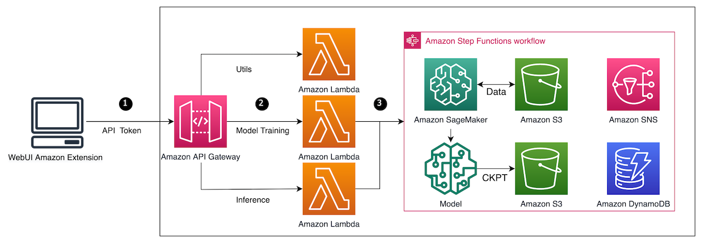

<h1 align="center">
  Extension for Stable Diffusion on AWS
</h1>
<h4 align="center">Extension for Stable Diffusion on AWS: Unlock the Power of image and video generation in the Cloud with Ease and Speed</h4>
<div align="center">
  <h4>
    <a href="https://github.com/awslabs/stable-diffusion-aws-extension/commits/main/stargazers"></a>
    <a href="https://opensource.org/license/apache-2-0"></a>
  </h4>
</div>


This is a webUI extension to help users migrate existing workload (inference, train, etc.) from local server or standalone server to AWS Cloud. Key features include:
* Support Stable Diffusion webUI inference along with other extensions through BYOC (bring your own containers) in the cloud.
* Support LoRa model training through Kohya_ss in the cloud.
* Support ComfyUI inference along with other extensions in the cloud. This supports users in conveniently releasing templates that require stable, continuous inference to the cloud. Additionally, users can make simple modifications (e.g., prompt adjustments) to the released templates on the cloud and maintain stable inference.


## Table of Contents
- [Architecture](#architecture)
- [Quick Start](#quick-start)
- [API Reference](#api-reference)
- [Version](#version)
- [License](#license)


## Architecture
The diagram below presents the architecture you can automatically deploy using the solution's implementation guide and accompanying Amazon CloudFormation template.


1. Users in WebUI console will trigger the requests to API Gateway with assigned API token for authentication. Note that no Amazon Web Services credentials are required from WebUI perspective.

2. Amazon API Gateway will route the requests based on URL prefix to different functional Lambda to implement util jobs (for example, model upload, checkpoint merge), model training and model inferencing. In the meantime, Amazon Lambda will record the operation metadata into Amazon DynamoDB (for example, inferencing parameters, model name) for successive query and association.

3. For training process, the Amazon Step Functions will be invoked to orchestrate the training process including Amazon SageMaker for training and SNS for training status notification.
For inference process, Amazon Lambda will invoke the Amazon SageMaker to implement async inference. Training data, model and checkpoint will be stored in Amazon S3 bucket delimited with difference prefix.


## Quick Start

There are 3 key features that the extension supports. There are 2 branches of deployment method, depending on the key feature that you'd like to deploy. 

* If you'd like to adopt SD webUI or Kohya in the cloud, please follow the instruction [here](./docs/zh/deployment/deployment.md). 
* If you'd like to adopt ComfyUI in the cloud, please follow the instruction [here](./docs/zh/deployment/deployment_comfyui.md).


## API Reference
To provide developers with a more convenient experience for invoking and debugging APIs, we offer a feature [API debugger](./docs/en/developer-guide/api_debugger.md). With this tool, you can view the complete set of APIs and corresponding parameters for cloud-based inference images with a single click.

1. Click the button to refresh the inference history job list
2. Pull down the inference job list, find and select the job
3. Click the `API` button on the right


The comprehensive APIs with sample can be found [here](./docs/en/developer-guide/api.md).

## Version
Check our [wiki](https://github.com/awslabs/stable-diffusion-aws-extension/wiki) for the latest & historical version

## License
This project is licensed under the Apache-2.0 License.

### Source Code Structure

```
.
├── CHANGELOG.md
├── CODE_OF_CONDUCT.md
├── CONTRIBUTING.md
├── LICENSE
├── NOTICE
├── README.md
├── THIRD-PARTY-LICENSES.txt
├── build_scripts -- scripts to build the docker images, we use these scripts to build docker images on cloud
├── buildspec.yml -- buildspec file for CodeBuild, we have code pipeline to use this buildspec to transfer the CDK assets to Cloudformation templates
├── deployment    -- scripts to deploy the CloudFormation template
├── docs
├── infrastructure -- CDK project to deploy the middleware, all the middle ware infrastructure code is in this directory
├── install.py -- install dependencies for the extension
├── install.sh --  script to set the webui and extension to specific version
├── javascript -- javascript code for the extension
├── middleware_api -- middleware api denifition and lambda code
├── sagemaker_entrypoint_json.py -- wrapper function for SageMaker
├── scripts -- extension related code for WebUI
└── utils.py -- wrapper function for configure options
```


