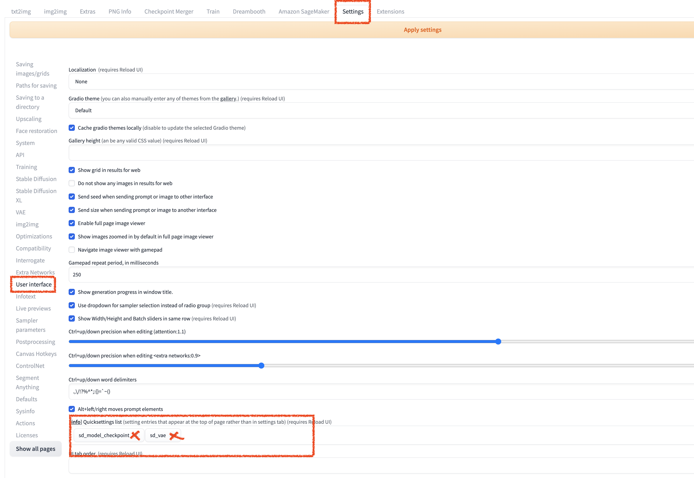

# Frequently Asked Questions

## General

**Q: What is Extension for Stable Diffusion on AWS?**

*Extension for Stable Diffusion on AWS* is an AWS solution that aims to assists customers migrate their Stable Diffusion model training, inference, and finetuning workloads on Stable Diffusion WebUI from local servers to Amazon SageMaker by providing extension and AWS CloudFormation template. By leveraging elastic cloud resources, this solution accelerates model iteration and mitigates performance bottlenecks associated with single-server deployments. 

**Q: What are the native features/third-party extensions of Stable Diffusion WebUI supported by this solution?**

This solution supports multiply native features/third-party extensions of Stable Diffusion WebUI. More details can be found at [Features and Benefits](./solution-overview/features-and-benefits.md).

**Q: What is the licence of this solution?**

This solution is provided under the [Apache-2.0](https://www.apache.org/licenses/LICENSE-2.0){:target="_blank"} license. It is a permissive free software license written by the Apache Software Foundation. It allows users to use the software for any purpose, to distribute it, to modify it, and to distribute modified versions of the software under the terms of the license, without concern for royalties.

**Q: How can I submit a feature request or bug report?**

You can submit feature requests and bug report through the GitHub issues. Here are the templates for [feature request](https://github.com/awslabs/stable-diffusion-aws-extension/issues/new?assignees=&labels=feature-request%2Cneeds-triage&projects=&template=feature_request.yml&title=%28module+name%29%3A+%28short+issue+description%29){:target="_blank"}, [bug report](https://github.com/awslabs/stable-diffusion-aws-extension/issues/new?assignees=&labels=bug%2Cneeds-triage&projects=&template=bug_report.yml&title=%28module+name%29%3A+%28short+issue+description%29){:target="_blank"}.

## Installation and Configuration

**Q: Is there a specific order for installing third-party plugins and the plugins for this solution?**

Currently, it is recommended that users install the third-party extensions supported by this solution before installing the solution's own extension. However, the installation order can be changed as well. In that case, a restart of the WebUI is required to ensure the successful functioning of the features.

**Q: After successfully installing the web UI, I am unable to access it in my browser. How can I resolve this?**

Before attempting to access the webUI link in your browser, please ensure that the necessary ports are open and not being blocked by a firewall.

**Q: How can I update the solution?**

Currently, it is recommended that users avoid frequently updating solutions by deploying stacks through CloudFormation. If updates are necessary, it is advised to uninstall the existing solution stack and then deploy a new stack based on the CloudFormation template. For all the future deployments using CloudFormation, in the 'Bucket' field, enter the S3 bucket name used in the previous deployment, and choose 'yes' for 'DeployedBefore' to ensure a successful redeployment of CloudFormation.

**Q: How can I change the login user on the same computer?**

You can switch to another user account by opening a new incognito browser window and logging in with the alternate user credentials.

**Q: How can I remove the local inference option so that my webUI can only support cloud inference?**

You can open the WebUI, navigate to tab **Settings** and select section *User interface* on the left session bar. Find field‘[info] Quick settings list (setting entries that appear at the top of page rather than in settings tab) (requires Reload UI)‘, and uncheck ‘sd_model_checkpoint'. After then, click ‘Apply setting', and reload webUI from terminal to make the change effective. After reloading the webUI, you will find that the checkpoint selecting drop down list on the upper left side disappeared, and user will only have a cloud inference option.

## Pricing

**Q: How will I be charged and billed for the use of this solution?**

The solution is free to use, and you are responsible for the cost of AWS services used while running this solution. You pay only for what you use, and there are no minimum or setup fees. Refer to the Centralized Logging with OpenSearch Cost section for detailed [cost estimation](./cost.md).

