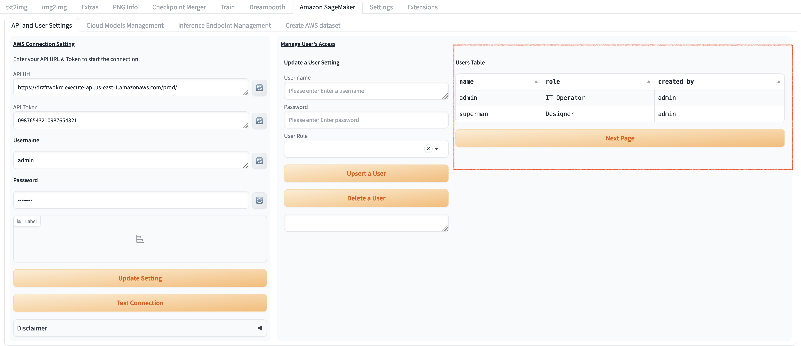

# API とマルチユーザーの設定

## API の設定

1. AWS CloudFormation コンソールを開き、正常にデプロイされたメインスタックを選択してください。
2. 「 Outputs 」タブに移動し、「 APIGatewayUrl 」と「 ApiGatewayUrlToken 」の情報をコピーしてください。
3. Stable Diffusion の WebUI を開き、「 Amazon SageMaker 」タブに移動し、ステップ 2 で取得した情報を「 API URL 」と「 API トークン」のフィールドに貼り付けてください。「ユーザー名」と「パスワード」のフィールドに、スーパーアドミンユーザーの情報を入力し、「接続テスト＆設定の更新」をクリックしてください。
4. 「正常に接続されました。設定が更新されました」というメッセージが表示されたら、フロントエンド UI が正常にバックエンドクラウドリソースに接続されたことを示しています。設定ファイルは、今後 WebUI を起動する際に自動的に対応する情報を表示するように更新されています。
5. 全ての機能に変更が反映されるよう、WebUI をバックグラウンドで再起動してください。

## マルチユーザー管理
IT オペレーターロールのユーザーがログインし、「 Amazon SageMaker 」タブの「 API とユーザー設定」サブタブに移動すると、ロールとユーザーを管理できます。

### ロール管理
「ロール管理」タブでは、ロールの表示、作成、対応するアクセス許可の設定ができます。新しいロールを作成したら、「次のページ」をクリックするか、ページを更新して「ロールテーブル」に反映させてください。

### アクセス許可の説明

| 名称                   | スコープ    | 許可                                                                                 |
|------------------------|------------|--------------------------------------------------------------------------------------| 
| role:all               | ロール      | ロールの作成、ロールリストの取得、ロールの削除                                         |
| user:all               | ユーザー    | ユーザーの作成、ユーザーリストの取得、ユーザーの削除、ユーザーの更新                     |
| sagemaker_endpoint:all | エンドポイント| エンドポイントの作成、エンドポイントリストの取得、エンドポイントの削除                 |
| inference:all          | 推論        | 推論タスクの作成と開始、推論タスクリストの取得、推論タスクの削除                        |
| checkpoint:all         | チェックポイント| モデルファイルの作成、モデルファイルリストの取得、モデルファイルの削除              |
| train:all              | 学習        | 学習タスクの作成、学習タスクリストの取得、学習タスクの削除                              |

### ユーザー管理

#### 新規ユーザーの追加
1. 必要に応じて新しいユーザー、パスワード、ロールを作成してください。「次のページ」をクリックすると、新しく作成されたユーザーが表示されます。Web UI サーバーに新規ユーザーに関する設定変更を反映させるには、Web UI を再起動する必要があります。
 

2. 別のシークレットブラウザを開き、新しく作成したユーザー名とパスワードでログインしてください。
3. Amazon SageMaker タブにアクセスすると、ユーザーによって表示されるコンテンツが異なることがあります。

#### 既存ユーザーの管理
1. 「ユーザーテーブル」から更新対象のユーザーを選択し、「パスワード」や「ユーザーロール」の更新が行えます。ユーザー情報は「ユーザー設定の更新」フィールドに表示されます。
2. 必要に応じてフィールドを更新し、「ユーザーの追加/更新」をクリックして変更を保存してください。削除する場合は「ユーザーの削除」をクリックします。
