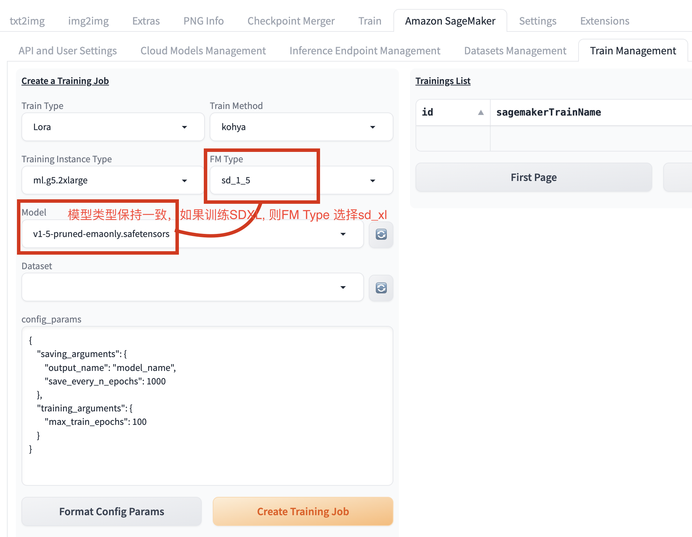
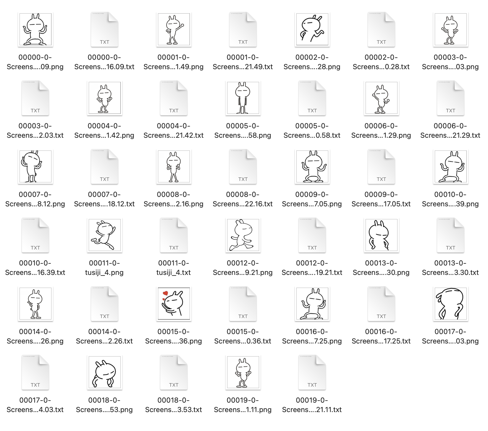
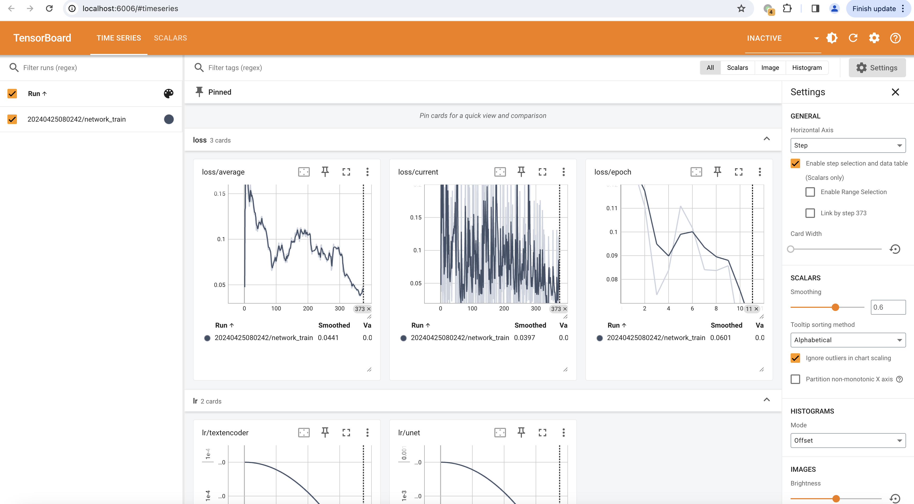

# 训练指南

训练基于[Kohya-SS](https://github.com/kohya-ss/sd-scripts)。 Kohya-SS是一个Python库，用于微调稳定扩散模型，适用于消费级GPU，并兼容稳定扩散WebUI。该解决方案可以在SDXL和SD 1.5上进行LoRA训练。如需体验UI的模型训练功能，需依循‘部署解决方案章节’中的‘新用户部署SD webUI’部分，进行webUI的部署。

## 训练用户指南
进入 Amazon SageMaker 面板，选择Train Management进入训练面板。
开始训练lora之前需要设置三部分内容：基础模型准备，数据集准备，设置训练参数，下面分别进行介绍。



### 准备基础模型
请刷新并查看**Model**下拉列表，确认本次训练所需的基础模型已经存在。否则，可以通过[云上资源管理](./webUI/CloudAssetsManage.md)中的**上传模型**功能，将基础模型上传至*SD Checkpoints*类别下。

同时，您也可以通过以下命令将本地SD模型上传到S3存储桶：
```
# 配置凭证
aws configure
# 将本地SD模型复制到S3存储桶
aws s3 cp *safetensors s3://<bucket_path>/<model_path>
```
!!! warning "注意"
    上图中两个红色框中选择需要匹配，即FM Type和Model类型保持一致，否则无法成功训练

### 准备数据集
数据集是模型训练、调优不可或缺的输入资料。

在以训练任务风格的LoRa模型为例，用户需要提前准备一个图片集，有统一主题或风格的、分辨率适中的图片，几十张即可。针对这个图片集，用户需要做预处理以适配基础模型能力，比如建议在针对基础模型SD 1.5的LoRa模型训练任务重，将图片提前裁剪成512 X 512像素大小。

预处理结束后，需要针对该图片集进行图片标注工作，即对每张训练图片加以文字描述，并保存为与图片同名的txt格式文本。图片标注可以通过SD WebUI中自带的图像标注功能，或者可以通过多模态大模型来完成。模型的标注也许不够完美，建议人工进行审核调整，以保证最终效果。

下图给出一个示例，每个图片有一个对应的txt文件，txt文件内容为图片的英文描述。


数据集准备完成后，请依循以下步骤，完成数据集上传。

1. 点击**Click to Upload a File**，在弹出的本地文件列表中，确认选中一次模型微调所需的所有图片。
2. 在**Dataset Name**输入该图片文件夹的名字
3. 在**Dataset Description**输入该数据集的描述
4. 在**Path Prefix**输入文件夹名称，该名称**应以数字和下划线开头**，比如上图中写的 **10_tusiji**，下划线前边的数字表示训练中一个epoch使用数据集的次数，10代表一个epoch会重复使用该图片集10次
5. 点击**Create Dataset**。

等待几秒，下方的Create Result区域显示Complete Dataset XXXX creation，即表示该数据集已经成功上传到云上。

!!! info "贴士"
    本方案也提供自动基于WD14的图片自动标注方式。为启动该自动标注功能，用户需遵循上方步骤，完成仅包含图片的数据集上传。之后在**Train Management**标签页的**config_params**找到*enable_wd14_tagger*并设置为true。之后点击**Create Training Job**，即会自动在送图片集进入模型训练前，进行WD14图片标注。

另外，用户可以通过以下方式将数据集上传，通过执行AWS CLI命令将数据集复制到S3存储桶
```
aws s3 sync local_folder_name s3://<bucket_name>/<folder_name>
```
!!! warning "注意" 
    folder_name应以数字和下划线开头，例如100_demo。每个图像应与具有相同名称的txt文件配对，例如demo1.png，demo1.txt，demo1.txt包含demo1.png的标题。

另外，本解决方案提供基于WD14的图片标注方法。如果需要启用该自动标注方法，

### 设置训练参数
在训练界面**config_params**添加训练参数，图中给出了简单的一个参数示例，用户根据不同训练任务
配置更多参数，参数内容参考https://github.com/kohya-ss/sd-scripts/blob/6b1520a46b1b6ee7c33092537dc9449d1cc4f56f/docs/train_network_README-zh.md
!!! warning "注意"
    参数中"output_name": "model_name"，model_name 为训练后存储的模型名字，无需添加后缀。

### 训练LoRa模型

待基础模型及数据集上传完成后，请遵循以下步骤：

1. 进入**Train Management**标签页，在**Training Instance Type**下拉列表选择训练作业所需的机器类型，通过**FM Type**选择此次训练的基础模型类型（即基于Stable Diffusion 1.5或者Stable Diffusion XL），通过**Model**选择此次训练的基础模型，通过**Dataset**选择本次训练需要依赖的数据集
2. 通过**config_params**调整基础训练参数，点击**Format Config Params**来检查并修改更新后的训练参数文件格式
3. 点击**Create Training Job**来提交模型训练作业
4. 后续训练状态可以通过刷新右侧**Tranings List**来跟进训练任务状态。
5. 成功训练完成的LoRa模型，可以直接在txt2img, img2img对应的云上LoRa模型选择列表直接选取，并参考[txt2img指南](./webUI/txt2img-guide.md)或[img2img指南](./webUI/img2img-guide.md)进行推理工作。

### 训练Loss的可视化
在 **Train Management** 页面, 所有训练完的任务都展示在**Training List**, 点击训练id, 下面会出现日志链接. 

点击该链接，则会跳转到新的网页，即loss可视化的界面。



### 调用训练API

参考[API文档](https://awslabs.github.io/stable-diffusion-aws-extension/zh/developer-guide/api/1.5.0/)调用训练API。
